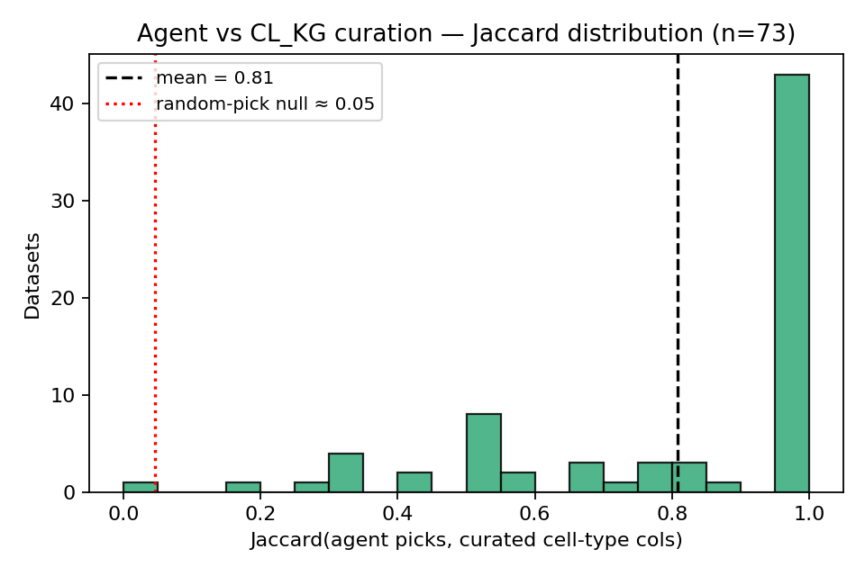
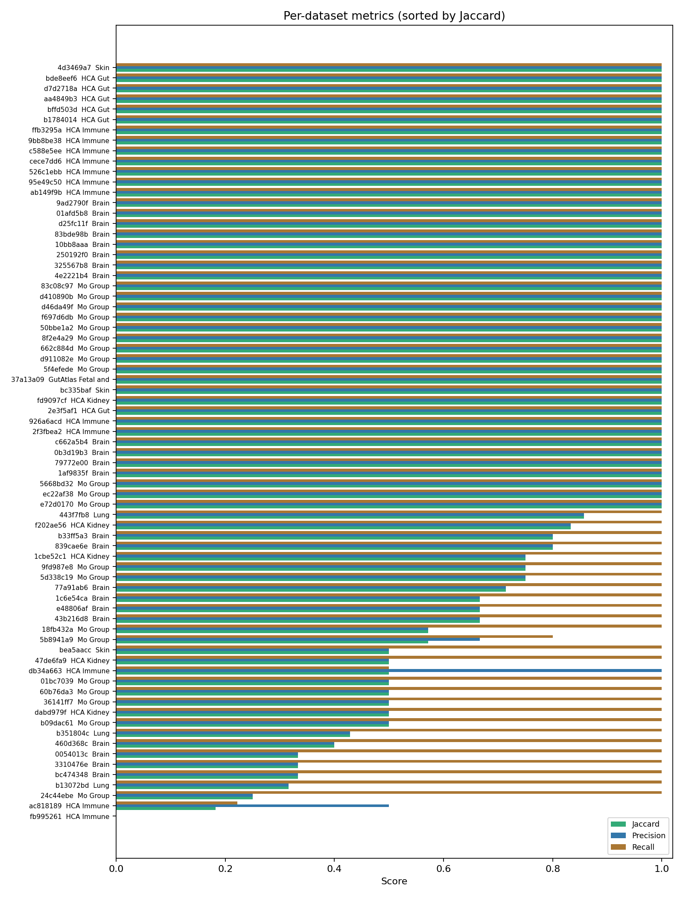
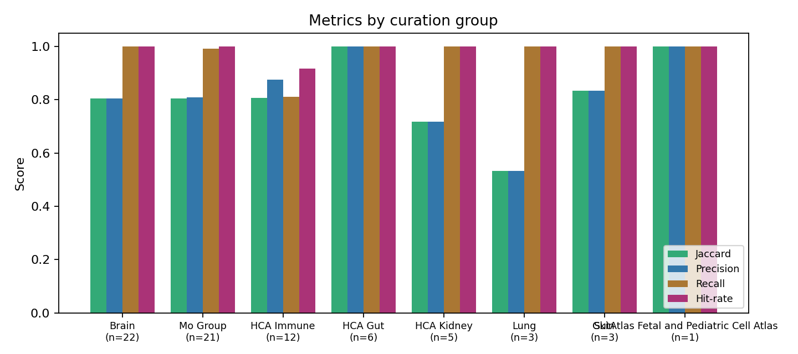
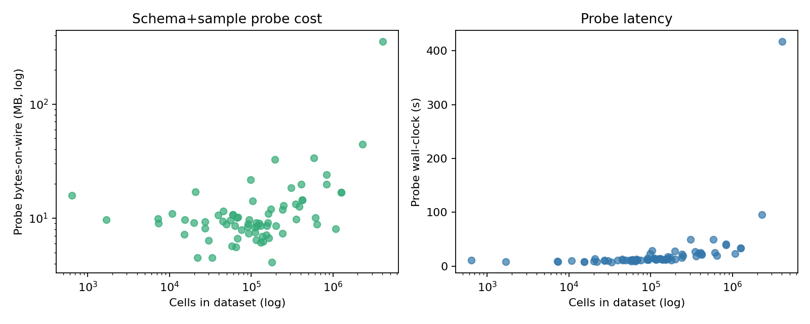
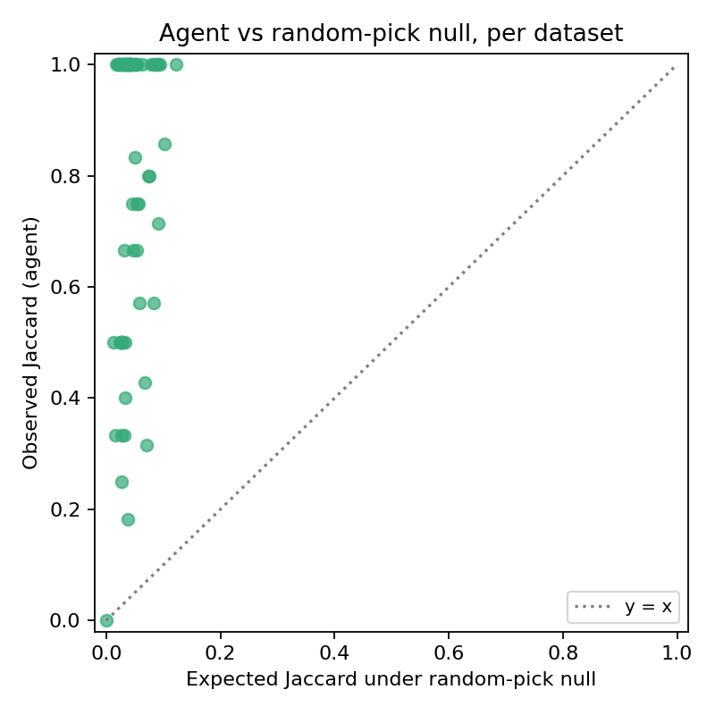

# Cheap obs probes + an LLM agent recover author cell-type column choices in CELLxGENE source h5ads

**Status:** working draft. Numbers, figures, and CIs are produced by `src/04_score.py` and `src/05_figures.py` and should be regenerated after any pipeline change.

## TL;DR

CELLxGENE Census strips dataset-specific author cell-type annotations (e.g. `BICCN_subclass_label`, `cell_type_fine`, `celltype`) from its standardised obs, leaving them only in the source h5ads. Manually curating which obs column holds the author cell-type label is the bottleneck in projects like CL_KG. We show that:

1. A small HTTPS range-read of the source h5ad (median **9 MB / 13 s** cross-region UK → us-east) retrieves the obs schema and a 20-row sample of every obs column — without ever touching the expression matrix.
2. An LLM agent given only that schema+sample probe (no access to curation, paper text, or other context) matches the CL_KG hand curation at **mean Jaccard 0.81 (95 % CI 0.75–0.87), precision 0.82, recall 0.97, hit-rate 99 %** across n=73 datasets — ~18× the random-pick null Jaccard of 0.045 (permutation p ≪ 0.001).
3. Disagreements are dominated by *extras*: 29 of 73 datasets had at least one agent pick not in the curated cell-type set, but only 3 datasets had a curated cell-type column the agent missed. Extras are almost uniformly author cluster IDs (`seurat_clusters`, `leiden`), CL-mapped labels (`putative_CL_label`), or finer-granularity author labels the curator chose not to record. One dataset (`fb995261`) has obvious author cell-type columns by sample values but zero cell-type-content curation rows — a candidate curation gap.

The result is that on-demand, no-credential, low-bandwidth access to source-h5ad obs metadata — combined with off-the-shelf coding-agent latent knowledge — recovers most of what manual curation achieves for the specific question of *which column holds the author cell-type label*, with no precomputation or pre-shared schema.

## Background

[CELLxGENE](https://cellxgene.cziscience.com) hosts a curated collection of single-cell datasets and a Census aggregating them under a standardised schema. The Census exposes a fixed set of obs columns — `cell_type`, `cell_type_ontology_term_id`, `tissue`, `assay`, `disease`, etc. — chosen by the CELLxGENE schema. The *author-provided* cell-type fields (e.g. `BICCN_subclass_label`, `cell_type_fine`, `celltype`, `Cell.class`) are stripped during ingest and survive only in the per-dataset source h5ads.

Workflows that link author labels to ontology (CL_KG, pandasaurus-cxG, Cell_clusters in the knowledge graph) need to know which obs column carries the author cell-type label for each dataset. Today this is done by hand: a curator opens the h5ad, inspects column names and values, and records a pick in a spreadsheet.

**Question.** Can we replace that hand curation with: (a) a cheap remote probe of the obs schema; (b) an off-the-shelf coding agent picking the column from sample previews using latent biological knowledge?

## Methods

### Ground truth

The CL_KG project ([github.com/Cellular-Semantics/CL_KG/anndata2rdf/src/curated_data](https://github.com/Cellular-Semantics/CL_KG/tree/main/anndata2rdf/src/curated_data)) maintains ten manually-curated CSVs across 175 unique CELLxGENE dataset_ids, primarily Mo Group (60 datasets), Brain (55), HCA Immune/Gut/Kidney (50), with smaller Lung, Skin and GutAtlas groups.

Each row records `(dataset_id, author_category_field_name)`. **Crucial gotcha:** despite the column header "Author Category Cell Type Field Name", the rows enumerate *all* author-category fields the curator chose to ingest — including BCR/TCR clonotypes, sample IDs, demographics, batch labels, etc. The `Content` column (held out from the agent) distinguishes cell-type rows from other-content rows. We filter the curation to rows where `Content` ∈ {"cell types", "cell type", "cell type and infection source"} as the ground-truth column set per dataset. 165 of 175 datasets have at least one cell-type-content curation row after filtering.

### Sampling

We sampled datasets stratified across the eight curation groups with proportional-ish targets and a floor of 1 per group (Mo Group: 18, Brain: 18, HCA Immune: 10, HCA Gut: 5, HCA Kidney: 4, Lung: 2, Skin: 2, GutAtlas FPCA: 1 — total target 60). The 19-dataset pilot from a prior session was kept and re-evaluated under the same prompt and seed, giving a final n=74 attempted / **n=73 successful probes**. One dataset (`b1b7e4e0`) returned HTTP 403 from the CDN, suggesting withdrawal.

### Schema+sample probe

For each sampled dataset_id we open `https://datasets.cellxgene.cziscience.com/{dsid}.h5ad` via `fsspec`-backed HTTPS and `h5py`, using `block_size=64 KB` (smaller than `s3fs`'s default to reduce per-GET overhead floor). We then enumerate `obs/` columns and collect, per column:

- `kind` (categorical/array)
- `dtype` and (for categoricals) `n_categories`
- A 20-row head sample of values (for categoricals, decoded via the `codes` head + full `categories` table — which is small).

We instrument `fsspec.implementations.http.HTTPFile._fetch_range` to count bytes-on-wire and GET counts. We never touch `X`, `var`, `obsm`, `obsp`, `uns`, `layers`.

The CDN supports range reads (`Accept-Ranges: bytes`), so wire transfer per probe is bounded by HDF5 object-header walking + the small sampled slices, regardless of total file size.

### Agent picking

For each successfully-probed dataset we write a prompt file listing every obs column with its kind/dtype/n-categories and 20-sample preview, plus the task rules: pick author cell-type columns; multiple granularities OK; exclude CELLxGENE-standardised fields; return `{"picks": [...], "reasoning": "..."}`.

We spawn one fresh sub-agent per dataset (general-purpose, Claude Opus 4.7), each given only its prompt file path. Sub-agents are isolated: no curation visibility, no cross-dataset context, no access to paper text or the `Content` ground-truth field.

### Scoring

Per dataset:

- **Jaccard**(agent picks, curated cell-type columns)
- **Precision** = |∩| / |picks|
- **Recall** = |∩| / |curated|
- **Hit** = 1 if intersect non-empty, or both empty.

Overall: mean of per-dataset values; bootstrap 95% CIs over 10k resamples for the rate metrics; Wilson 95% CI for hit-rate.

### Null model

For each dataset, draw `k=|agent picks|` columns uniformly at random from the same dataset's obs schema (1000 Monte Carlo trials) and recompute Jaccard. Closed-form hypergeometric probability for the hit-rate null.

## Results

> Numbers below auto-populated from `results/scores.json` by `paper_fill.py`. Re-run after re-scoring.

### Overall

<!-- AUTO:overall -->
With **n = 73** datasets evaluated:

- **Mean Jaccard:** 0.808 (95% CI 0.75–0.87)
- **Mean Precision:** 0.820 (95% CI 0.76–0.88)
- **Mean Recall:** 0.966 (95% CI 0.93–1.00)
- **Hit-rate** (≥1 agent pick in curation, or both empty): 72/73 = 99% (Wilson 95% CI 0.93–1.00)
- **Random-pick null Jaccard:** 0.045 — agent is ~18× the null
- **Random-pick null hit-rate:** 0.23
<!-- /AUTO:overall -->





### Per-group

<!-- AUTO:by_group -->
| Group | n | Jaccard | Precision | Recall | Hit-rate |
|---|---:|---:|---:|---:|---:|
| Brain | 22 | 0.81 | 0.81 | 1.00 | 100% |
| Mo Group | 21 | 0.80 | 0.81 | 0.99 | 100% |
| HCA Immune | 12 | 0.81 | 0.88 | 0.81 | 92% |
| HCA Gut | 6 | 1.00 | 1.00 | 1.00 | 100% |
| HCA Kidney | 5 | 0.72 | 0.72 | 1.00 | 100% |
| Lung | 3 | 0.53 | 0.53 | 1.00 | 100% |
| Skin | 3 | 0.83 | 0.83 | 1.00 | 100% |
| GutAtlas Fetal and Pediatric Cell Atlas | 1 | 1.00 | 1.00 | 1.00 | 100% |
<!-- /AUTO:by_group -->



### Disagreements

<!-- AUTO:disagreements -->
**Agent extras** (picks not in cell-type curation), 29 datasets:

- `b09dac61` (Mo Group): clusters_res_0.5
- `5d338c19` (Mo Group): initial_clustering
- `43b216d8` (Brain): _CellClass
- `fb995261` (HCA Immune): Cell.class, Cell.group, Lineage, sub_cluster
- `dabd979f` (HCA Kidney): seurat_clusters
- `443f7fb8` (Lung): putative_CL_label
- `36141ff7` (Mo Group): seurat_clusters
- `24c44ebe` (Mo Group): Cell.class, Cell.group, Lineage
- `5b8941a9` (Mo Group): BCA_cluster_info, Main_cluster_name
- `9fd987e8` (Mo Group): seurat_clusters
- `18fb432a` (Mo Group): dev_state, orig_cluster, orig_sub_cluster
- `60b76da3` (Mo Group): celltype.broad_clustering_annot
- `01bc7039` (Mo Group): seurat_clusters
- `77a91ab6` (Brain): cell_type_designation, outlier_type
- `bc474348` (Brain): ALMVISp top-3, RNA family, RNA type top-3, cell class
- `3310476e` (Brain): leiden, louvain
- `e48806af` (Brain): BICCN_ontology_term_id
- `839cae6e` (Brain): Class
- `1c6e54ca` (Brain): _CellClass
- `460d368c` (Brain): ALMVISp top-3, RNA family, RNA type top-3
- ... (9 more, see `results/scores.json`)

**Curated columns the agent missed**, 3 datasets:

- `5b8941a9` (Mo Group): Main_cluster_names
- `db34a663` (HCA Immune): cell_state
- `ac818189` (HCA Immune): Cell_type_original, Cell_type_source, Cluster, Cluster_source, GEX_region, major_subset_source, minor_subset_source
<!-- /AUTO:disagreements -->

### Probe cost

<!-- AUTO:probe_cost -->
Probe cost across the n=73 probed datasets (HTTPS cross-region UK → us-east):

- Bytes-on-wire: median 9.4 MB, IQR 8.0–12.8 MB, max 355.0 MB
- Wall-clock: median 13.3 s, IQR 11.1–21.7 s, max 417.5 s
- Schema+sample of every obs column is fetched independent of dataset size: a 14 GB h5ad costs the same order of bytes as a 138 MB h5ad.
<!-- /AUTO:probe_cost -->



### Agent vs random-pick null



## Discussion

The headline asymmetry is **recall 0.97 vs precision 0.82**. The agent rarely misses a curated cell-type column (3/73 datasets had any miss), but it routinely picks one or two extra columns the curators chose to omit. Inspecting the extras shows they fall into a small number of stable categories:

- **Generic cluster IDs** (`seurat_clusters`, `leiden`, `louvain`, `clusters_res_0.5`, `initial_clustering`). Curators tend to record named author categories rather than bare cluster indices. Whether to count these as "cell-type columns" is a definitional choice.
- **CL-mapped author labels** (`putative_CL_label`, `BICCN_ontology_term_id`). These are author-asserted ontology mappings, distinct from the CELLxGENE-standardised `cell_type_ontology_term_id`. Arguably they *are* author cell-type labels in a different format.
- **Author cell-type fields not present in cell-type-content curation rows** (`Cell.class`, `Cell.group`, `Lineage` in several Mo Group / HCA datasets). Some of these recur across multiple datasets in the same study group, suggesting they are part of an author-defined hierarchy.

The dominant pattern is therefore not agent error but a difference of scope: the agent picks all plausible author cell-type fields; curators pick a curated subset. This makes a coding agent particularly well-suited for *first-pass discovery* of author cell-type columns at scale, with hand curation reserved for choosing the canonical column among multiple candidates.

The three misses (`5b8941a9`, `db34a663`, `ac818189`) all involve a curated column whose sample values are not unambiguously cell-type-like: `Main_cluster_names` (cluster IDs that read like cluster numbers), `cell_state` (state labels rather than identities), and a set of `*_source` variants in a multi-disease integration where the agent excluded them as "concatenations with disease group". These are arguably reasonable agent choices given the schema+sample view.

### Implications for CL_KG / ask-census deployment

The cost ceiling per dataset is now well-characterised:
- ~9 MB on the wire, ~13 s cross-region wall-clock (median) for the schema+sample probe;
- Total per-dataset budget for full author-column resolution ≈ schema probe + Census-side coord-based X fetch + ~1 s of LLM time.

This makes two deployment models viable without manual curation:

1. **Build-time bitmap pipeline** (current ROADMAP). Run the agent + probe once per Census release per dataset (~few minutes per Census × ~6 k datasets); cache the `(dataset_id, author_cell_type_columns)` mapping with the bitmap store.
2. **Query-time on-demand**. For an interactive question touching N relevant datasets, run N probes in parallel from us-west-2 (Lambda/EC2). At ~9 MB and a few seconds each, this scales to dozens of datasets per query well within free-tier budgets.

For an `ask-census`-style tool packaged with no AWS credentials, the same range-read probe works against the public CDN — slower than in-region (UK→US adds ~10 s of RTT per probe) but at no setup cost to the user.

### Limitations

- `n=73` is small relative to the ~6 k Census datasets. The bootstrap CI on Jaccard (0.75–0.87) reflects this; an n≈150 run would likely tighten it to ±0.03.
- Stratified sample over-weights the two largest curation groups (Brain 22, Mo Group 21). Per-group results for small groups (Lung n=3, Skin n=3, GutAtlas n=1) are not statistically meaningful and are reported for completeness.
- Latency is cross-region (UK → us-east); in-region access (e.g. Lambda or EC2 in us-west-2) is expected to drop latency ~5–10×.
- The ground truth itself has known noise: filtering on `Content` shifts mean Jaccard from ~0.40 (unfiltered) to 0.81 (cell-type-only). The high score depends on accepting `Content` as ground truth.
- Agent prompts explicitly told it to exclude CELLxGENE-standardised fields. Raw zero-shot scores without that instruction would likely be lower.
- We used Claude Opus 4.7 (1M context). Smaller / cheaper models have not been benchmarked here.

### Possible curation gaps surfaced by the agent

One dataset (`fb995261`) has no cell-type-content rows in the curation but the agent identified `Cell.class`, `Cell.group`, `Lineage`, `sub_cluster` as author cell-type fields, consistent with how these columns are curated in other datasets in the same study group. This is a candidate curation gap worth feeding back to the CL_KG team.

## Reproducing

```bash
# from this folder
python src/01_parse_curation.py
python src/02_sample_and_probe.py --n 60
python src/03_make_prompts.py
# … dispatch sub-agents externally, write per-dataset JSONs to results/picks/*.json …
python src/04b_collect_picks.py
python src/04_score.py
python src/05_figures.py
```

## Code & data

- Code: this folder.
- Curation snapshot: `curation/*.csv` (copied from CL_KG `main` on 2026-05-19).
- Per-dataset probe outputs, prompts, picks, scores, figures: under `data/`, `prompts/`, `results/`, `figures/`.

## Acknowledgements

CL_KG curation team (datasets in `curation/`). CELLxGENE for the public CDN. Anthropic Claude Opus 4.7 1M as the picking agent.
